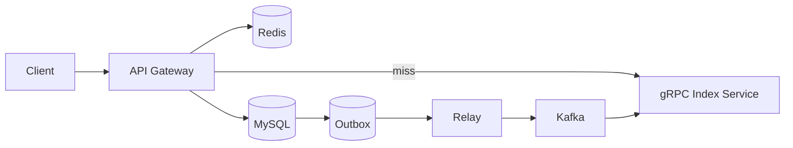

# MyRadic 架构与实现说明（面试版）

> 更新时间：2026-02-27  
> 目标读者：面试官 / 技术评审 / 项目协作者  
> 关键词：分布式搜索、最终一致性、倒排索引、高并发、可观测性、压测

---

## 1. 项目定位（一句话）

`my_radic` 是一个使用 Go 从零实现的分布式实时搜索系统，核心目标是在“可接受一致性延迟”下提供高并发检索能力，并具备可解释的架构取舍与工程化落地。

---

## 2. 架构总览

### 2.1 组件与职责

- `api_gateway`：系统统一入口，负责接入层协议（WebSocket/HTTP）、缓存、防击穿、搜索聚合。
- `index_service`：索引构建与检索服务，通过 gRPC 暴露能力，按分片水平扩展。
- `mysql`：业务主存，保存文章及 `outbox`（事务发件箱）。
- `kafka`：异步总线，解耦“写入主存”和“构建索引”。
- `redis`：热点查询缓存。
- `etcd`：服务注册与发现（gateway 侧动态感知 indexer 节点）。

### 2.2 请求链路（简图）



---

## 3. 核心数据流

## 3.1 写入流（发布文档）

1. Gateway 收到写请求。  
2. 在 MySQL 单事务中同时写入：
   - 业务表（如文章）
   - `outbox` 表（待投递消息）  
3. Relay 后台轮询 `outbox`，投递到 Kafka。  
4. Index Service 消费 Kafka，写正排存储并更新内存倒排索引。  

### 为什么是这个方案

- 解决“DB 成功但消息丢失”与“消息成功但 DB 失败”的双写不一致。
- 投递语义是 `at-least-once`，通过下游幂等确保最终状态正确。
- 业务上允许短暂“写后延迟可搜”，所以最终一致是合理 trade-off。

## 3.2 查询流（搜索）

1. Gateway 收到查询请求（生产场景主用 WebSocket；保留 HTTP 接口主要用于压测与调试）。  
2. 先查 Redis，命中直接返回。  
3. 未命中时进入 SingleFlight（同 key 归并），只触发一次下游 gRPC 搜索。  
4. Gateway 向 indexer 分片并发请求并聚合结果，回写缓存。  

## 3.3 场景化走查（建议面试时照这个讲）

### 场景 1：用户发布一篇文章

**业务预期**
- 接口返回成功后，文章最终必须可搜，不能“永久丢失”。

**技术挑战**
- 数据要同时进入 MySQL 和索引，天然是双写。

**采用方案**
- 同事务写业务数据 + outbox；异步投递 Kafka；indexer 消费后建索引。

**为什么不用同步 RPC 双写**
- 同步双写原子性弱、下游故障会拖慢主链路、补偿复杂。

**代价**
- 强实时性让位于最终一致，存在短暂可见性延迟。

### 场景 2：热门关键词瞬时并发查询

**业务预期**
- 热点词并发冲击时，系统不能被击穿。

**技术挑战**
- 缓存 miss 时，同 key 高并发会放大下游请求。

**采用方案**
- Redis 缓存 + SingleFlight 回源归并 + 分片并发检索。

**为什么这样组合**
- 缓存负责“降频”，SingleFlight负责“归并”，分片并发负责“吞吐”。

**代价**
- 首个慢请求可能拖累同 key 等待者，必须配合超时与熔断策略。

---

## 4. 索引内核设计

## 4.1 存算分离

- **算（内存）**：SkipList 倒排索引，用于快速检索与布尔合并。
- **存（本地 KV）**：BoltDB/Badger 作为正排与持久化基础，重启可恢复。

## 4.2 选 SkipList 的原因

- 动态插入复杂度好（相对数组追加后维护排序更可控）。
- 适合实现 `SkipTo` 以优化交并集求解。
- 对 Go 并发实现更友好，易于控制复杂度。

## 4.3 一致性与幂等

- 消费重复消息是常态（网络抖动、重试、重平衡）。
- Index 更新逻辑按文档 ID 覆盖/去重，确保重复消费不造成结果污染。

---

## 5. 服务治理与弹性

## 5.1 服务发现与负载

- Index 节点注册到 etcd。
- Gateway watch 节点变更，维护本地连接与分片路由。
- gRPC 客户端连接管理采用“锁外构建 + 锁内提交”以降低热点锁竞争。

## 5.2 优雅停机（已落地）

- 入口服务支持优雅关停流程（停止接收新流量 -> 处理在途请求 -> 超时退出）。
- WebSocket 连接集中由 `ws_hub` 管理，支持 shutdown 时主动 `CloseAll`。
- 通过 readiness/liveness 配合 K8s，下线期间尽量避免新请求进入。

---

## 6. 可观测性与性能诊断

## 6.1 指标体系

- Prometheus 暴露接口级吞吐、延迟、状态码等指标。
- pprof 结合火焰图用于 CPU/锁/阻塞热点定位。

## 6.2 已识别热点（近期压测）

- 高频日志输出会明显推高 `runtime.cgocall / syscall write` 占比，影响尾延迟。
- 已做日志结构化、异步化与采样降噪，降低 IO 干扰。
- 在单机 Docker Desktop + kind（3 worker 逻辑集群）场景，平台层（容器运行时/控制面）会先到上限，出现 `TLS handshake timeout`，并非纯业务逻辑瓶颈。

---

## 7. 压测结论（截至 2026-02-27）

> 详细记录见 `deploy/k8s/loadtest/PERF_REPORT_2026-02-27.md`

- 3 worker（同一宿主机）可稳定跑到 `~9k RPS`。  
- 冲到 `12k+` 时出现平台不稳定（K8s API / Docker Desktop 超时），结果不可重复。  
- 在平台状态较好时能冲到 `13k~14k RPS`，但 `p95/p99` 显著恶化，属于“吞吐可挤、质量不稳”区间。  

### 解释

- kind 多 worker 只是逻辑分布式，算力仍是单机池。
- 当平台开销（网络栈、容器调度、控制面）占主导时，横向收益会被吃掉。

---

## 8. 关键权衡（面试高频）

- 一致性：选择最终一致 + 幂等，而非全链路强一致事务。
- 性能：优先保障高频路径（缓存、归并、连接管理），接受冷路径复杂度。
- 可维护性：索引内核自主可控，但保留存储引擎可替换能力。
- 可靠性：先保证“不会错”，再优化“更快”。

### 8.1 为什么不直接依赖现成搜索中间件

**不是不能用，而是当前项目目标不同：**
- 目标是展示从索引内核到一致性链路的完整设计与实现能力。
- 需要可解释每个关键取舍（结构、协议、治理、可观测）。
- 代价是研发成本更高、工程细节更多，但可学习价值和面试价值更高。

---

## 9. 风险与改进路线

## 9.1 当前风险

- Relay 轮询模式在高写入下会产生 DB 压力。
- 单机环境压测结论不代表真实多机集群上限。
- 极限压力下平台层先失稳，影响性能结论置信度。

## 9.2 下一步优先级

1. **P0**：稳态压测基线（`3k/6k/9k/12k` 固定回归）。  
2. **P1**：压测时联动采集 pprof + Prometheus + 节点资源。  
3. **P2**：迁移到多物理机/云主机做真分布式基准。  
4. **P3**：评估 CDC 替代轮询 outbox，降低主库压力。  

---

## 10. 代码目录导航（面试可快速指路）

- `cmd/api_gateway/main.go`：gateway 启动入口与生命周期。  
- `api_gateway/router/router.go`：路由、搜索入口、WebSocket handler。  
- `api_gateway/router/ws_hub.go`：WebSocket 连接管理与 shutdown 关闭策略。  
- `api_gateway/rpc/client.go`：indexer 路由、连接管理、负载逻辑。  
- `cmd/index_service/main.go`：index 服务启动与依赖初始化。  
- `index_service/index_service.go`：消费、建索引、服务注册核心逻辑。  
- `util/logger.go`：结构化日志、异步写、采样策略。  
- `deploy/k8s/loadtest/README.md`：压测 runbook。  

---

## 11. 快速复现（本地）

```bash
# 1) 启动依赖
docker-compose up -d

# 2) 启动 index service
go run ./cmd/index_service/main.go

# 3) 启动 gateway
go run ./cmd/api_gateway/main.go -port 8080
```

---

## 12. 面试中建议的开场 30 秒

“这个项目我主要解决了三个问题：第一是通过 Transactional Outbox + Kafka 实现写入到索引的最终一致性；第二是通过 Redis + SingleFlight + 分片并发检索保证高并发查询；第三是做了完整可观测和压测闭环，能够把瓶颈区分为业务热点和平台上限，并且有明确优化路线。”  

---

## 13. 典型工程问题与解法（面试可引用）

### 13.1 节点动态变更引发尾延迟抖动

- **问题现象**：服务节点上下线时，搜索接口 p99 突刺。  
- **根因**：连接重载期间慢操作（拨号）阻塞共享锁。  
- **解决方案**：连接更新改为“锁外准备 + 锁内提交”。  
- **效果**：节点变更期间延迟更平滑。

### 13.2 高并发下日志写路径成为热点

- **问题现象**：压测吞吐上不去，CPU 主要消耗在系统调用写日志。  
- **根因**：同步日志 + 高频成功请求打印。  
- **解决方案**：结构化日志、异步落盘、成功请求采样。  
- **效果**：日志干扰下降，性能测试结果更稳定。

### 13.3 滚动发布期间 WebSocket 连接残留

- **问题现象**：重启后客户端存在僵尸连接，偶发错误。  
- **根因**：缺少统一连接回收机制。  
- **解决方案**：引入 `ws_hub` 管理连接生命周期，并在 shutdown 主动 `CloseAll`。  
- **效果**：发布期连接行为可控，恢复更快。

### 13.4 压测高档位结果不可复现

- **问题现象**：同参数多次压测波动过大，优化结论不可信。  
- **根因**：测试口径与平台状态不一致（缓存状态、并发档位、宿主机负载）。  
- **解决方案**：固定压测模板与分档，区分 warm/cold，统一结果落盘格式。  
- **效果**：性能回归具备可比性和可解释性。
